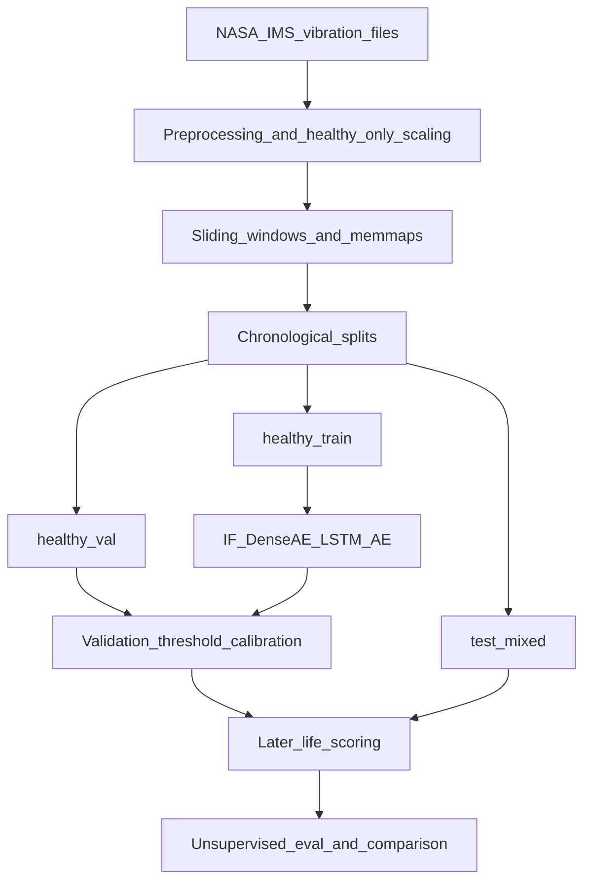
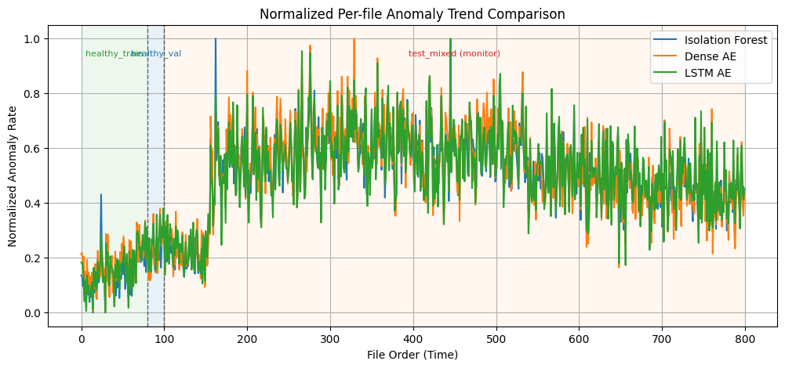
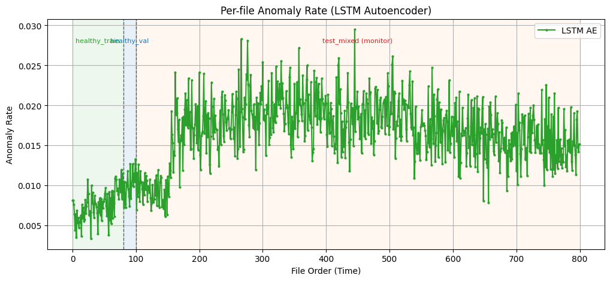

# NASA IMS Vibration Anomaly Detection

A Python machine learning pipeline for unsupervised anomaly detection and predictive maintenance using NASA IMS bearing vibration data.

The pipeline learns normal behavior from early healthy operation and monitors changes throughout the bearing's run-to-failure lifecycle using Isolation Forest, dense autoencoders, and LSTM autoencoders. It is a modular CLI research and portfolio project (not a deployed service), with emphasis on leakage-safe evaluation, disk-backed preprocessing for large sequence corpora, and model comparison without ground-truth failure labels.

Industrial equipment often produces large volumes of sensor data without labeled failure examples. This project asks whether models trained only on early healthy vibration behavior can surface meaningful changes as a bearing progresses through its run-to-failure lifecycle.

## Pipeline



## Highlights

- Preprocessing with automatic file discovery, healthy-only global scaling, and disk-backed (`np.memmap`) sequence datasets
- Three detectors trained on healthy data: Isolation Forest, dense autoencoder, and LSTM autoencoder
- Leakage-safe workflow: fit on `healthy_train`, calibrate thresholds on `healthy_val`, score later-life files
- Unsupervised model comparison (false-alarm rate, late-life alert rate, trend strength, alert persistence, signal separation)
- Diagnostic plots/JSON artifacts and an optional end-to-end `pipeline` orchestrator

## Results

Figures below come from local experiment runs. Exact curves depend on config, hardware, and how many files were processed. The default clone setting (400 files) will not automatically reproduce a full-corpus experiment.



Normalized per-file anomaly-rate comparison (min–max scaled per model for shape comparison, not absolute rate). Shaded regions mark the chronological policy splits: `healthy_train` (fit models), `healthy_val` (calibrate thresholds), and `test_mixed` (later-life monitoring). All three detectors show a similar regime change well into monitoring—evidence of a shared shift in the scored vibration behavior, not a supervised “failure detected” label.



LSTM autoencoder **absolute** per-file anomaly rate with the same split markers. Thresholds are calibrated on held-out `healthy_val` reconstruction errors; alert density stays relatively low in the train/val policy window and rises later in `test_mixed`. Quiet files early in monitoring are not independently labeled healthy—only the train/val split defines the healthy reference. This is unlabeled run-to-failure trend monitoring.

### Experiment notes

With the default configured window settings (`sequence_length=100`, `stride=5`), preprocessing **400** IMS files yields approximately **13.1 million** sliding-window sequences (`400 × 32,749` windows per file in this dataset layout). A larger local experiment on **800** files produced about **26.2 million** sequences under the same window settings. Isolation Forest, the dense autoencoder, and the LSTM autoencoder were trained on healthy data and compared in the same split-aware evaluation framework. Full `1st_test` runs can be configured up to **2156** usable files in `src/config.py`.

## Key engineering decisions

| Challenge | Approach |
|-----------|----------|
| Millions of sliding-window sequences | Disk-backed NumPy memmaps, with streaming evaluation when the full “all” memmap exceeds a size budget |
| No labeled failure windows | Unsupervised metrics: healthy false-alarm rate, late-life alert rate, trend strength, persistence, effect size |
| Avoiding degradation leakage | Chronological `healthy_train` / `healthy_val` / `test_mixed` splits |
| Threshold selection | Calibrate exclusively on held-out healthy validation data |
| Comparing different model score scales | Normalized file-level anomaly-rate trends, plus absolute-rate views |

## Tech stack

Python 3.11+ · NumPy · scikit-learn · PyTorch · joblib · Matplotlib

## Project layout

```text
├── data/                  # Local only (gitignored): raw IMS + processed artifacts
├── docs/images/           # Tracked result figures for the README
├── models/                # Local checkpoints only (gitignored)
├── notebooks/             # Exploratory analysis
├── src/
│   ├── config.py
│   ├── dataset.py
│   ├── preprocessing.py
│   ├── models/            # Dense and LSTM autoencoder architectures
│   ├── train_isolation_forest.py
│   ├── train_dense_autoencoder.py
│   ├── train_lstm_autoencoder.py
│   ├── evaluate.py
│   ├── evaluate_autoencoder.py
│   ├── evaluate_unsupervised.py
│   ├── evaluation_interface.py
│   ├── compare_models.py
│   ├── pipeline.py
│   ├── logging_utils.py
│   └── utils.py
├── tests/
├── requirements.txt
├── LICENSE
└── README.md
```

## Setup

Prerequisites: Python 3.11+ and a virtual environment.

```powershell
python -m venv .venv
.\.venv\Scripts\Activate.ps1
python -m pip install --upgrade pip
python -m pip install -r requirements.txt
```

`requirements.txt` leaves PyTorch unpinned because the appropriate installation can depend on your platform and CUDA environment. For GPU acceleration, install the CUDA-compatible PyTorch build for your system from [pytorch.org](https://pytorch.org/get-started/locally/), then install the remaining dependencies with `pip install -r requirements.txt`. On CPU-only machines, installing from `requirements.txt` as shown above is sufficient.

### Data

1. Download the [NASA IMS Bearing Dataset](https://data.nasa.gov/dataset/ims-bearings).
2. Place files under `data/raw/` (for example `data/raw/IMS/1st_test/`), matching `data_folder` in `src/config.py`.

Raw data, memmaps, scalers, and trained weights are not stored in this repository.

### Configuration scale

Default `num_files_to_process` in `src/config.py` is **400**, which keeps local experimentation manageable.

For a full IMS `1st_test` pass, set `num_files_to_process` to **2156** (usable files in that run). Larger runs produce far more sliding-window sequences and may skip the full `all_sequences.dat` memmap on Windows when the size budget is exceeded; evaluation then streams from raw files using `split_metadata.json`.

## Quick start

Run unit tests:

```powershell
python -m unittest discover -s tests -v
```

Preprocessing and Isolation Forest baseline:

```powershell
python -m src.run_preprocessing
python -m src.train_isolation_forest
python -m src.evaluate
```

Autoencoders:

```powershell
python -m src.train_dense_autoencoder
python -m src.evaluate_autoencoder --model-type dense

python -m src.train_lstm_autoencoder
python -m src.evaluate_autoencoder --model-type lstm
```

Compare anomaly-rate trends and run unsupervised quality scoring:

```powershell
python -m src.compare_models
python -m src.evaluate_unsupervised --all-models
```

Optional full orchestration:

```powershell
python -m src.pipeline
```

Primary outputs are written under `data/processed/diagnostics/`.

## Data split strategy

Chronological files are assigned as follows (defaults in `src/config.py`):

- `healthy_train` — early-life healthy files used to fit anomaly models
- `healthy_val` — healthy holdout used only for threshold selection
- `test_mixed` — later-life files used for trend monitoring and anomaly-rate analysis

Split-aware artifacts from preprocessing:

- `healthy_train_sequences.dat`
- `healthy_val_sequences.dat`
- `all_sequences.dat` (optional; may be skipped when over the configured byte budget)
- `split_metadata.json`
- `global_scaler.save`

**Why global scaling:** a single scaler fitted on healthy files preserves absolute amplitude shifts that matter for later-life scoring. Per-file normalization would hide those shifts.

## Threshold policy

- Isolation Forest: threshold from `healthy_val` decision scores (percentile in config)
- Autoencoders: threshold from `healthy_val` reconstruction-error percentiles

Thresholds are not fitted on late-life files, which keeps the decision rule leakage-safe relative to the degradation period being monitored.

## Evaluation scope

NASA IMS is used here without per-window failure labels. Model selection uses unsupervised metrics:

- Healthy false-alarm rate
- Late-life alert rate
- Spearman trend strength over file order
- First persistent alert index (`k-of-m` persistence)
- Healthy-vs-late-life signal separation (effect size)

An evaluation adapter (`evaluation_interface`) supports the current unsupervised path. Change-window business scoring (for example stakeholder accuracy over defined change intervals) is intentionally not implemented yet.

## How to interpret outputs

- `isolation_forest_file_metrics.json` — per-file mean score and anomaly rate
- `dense_autoencoder_file_metrics.json` / `lstm_autoencoder_file_metrics.json` — per-file reconstruction trends
- `*_threshold.json` — saved threshold and percentile rule
- `model_comparison_anomaly_rate.png` — normalized trend comparison across models

Practical reading pattern:

1. Confirm the healthy policy window shows lower anomaly rates than later monitoring.
2. Retrain with the same split rule and check that thresholds remain stable.
3. Compare Isolation Forest vs dense AE vs LSTM AE trends, then tune hyperparameters.

## References

- [NASA IMS Bearing Dataset](https://data.nasa.gov/dataset/ims-bearings)
- [Isolation Forest (scikit-learn)](https://scikit-learn.org/stable/modules/generated/sklearn.ensemble.IsolationForest.html)
- [NumPy memmap](https://numpy.org/doc/stable/reference/generated/numpy.memmap.html)

## License

This project is licensed under the MIT License. See [LICENSE](LICENSE) for details.
